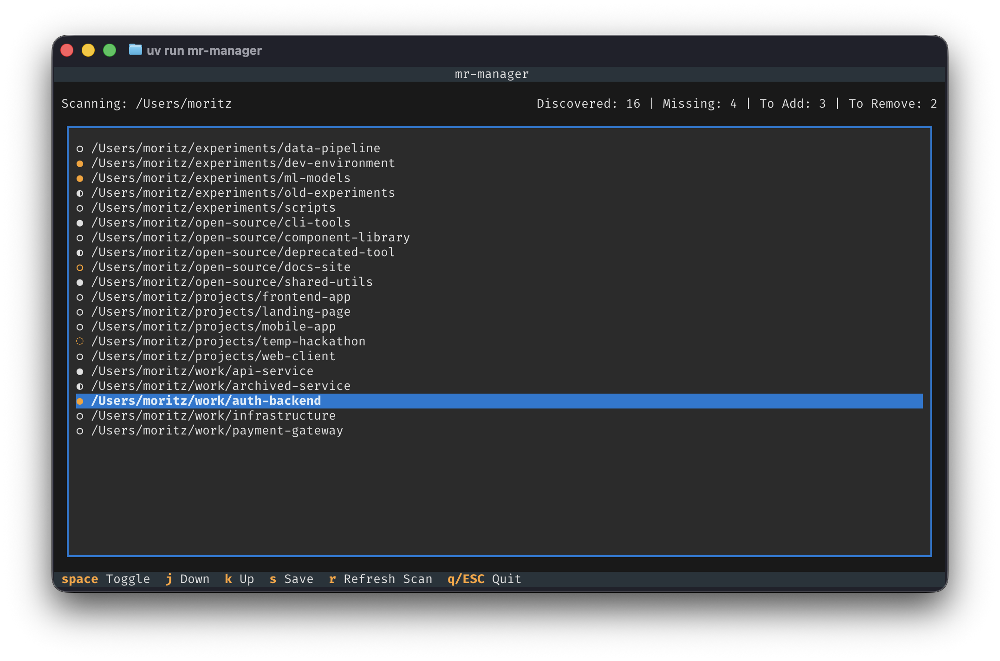

<div align="center">
  <h1>mr-manager</h1>
</div>

<div align="center">
    <a href="https://github.com/mowi12/mr-manager/releases/latest">
        
    </a>
    <a href="https://github.com/mowi12/mr-manager/actions/workflows/code_quality_checks.yml">
        
    </a>
    <a href="https://github.com/mowi12/mr-manager/wiki">
        
    </a>
    <a href="https://deepwiki.com/mowi12/mr-manager">
        
    </a>
    <a href="https://github.com/mowi12/mr-manager/blob/main/LICENSE">
        
    </a>
</div>

---

`mr-manager` is a [Textual](https://textual.textualize.io/) TUI for managing repositories in your
`~/.mrconfig` [myrepos](https://myrepos.branchable.com/) file. It discovers Git repositories under your home
directory and lets you toggle which ones are tracked.



## Features

- Discovers local Git repositories recursively.
- Fast startup using a cached filesystem scan (24-hour TTL).
- Reads existing repo sections from `~/.mrconfig`.
- Interactive keyboard-driven selection UI.
- Saves add/remove config updates safely.
- Highlights missing configured repositories.

## Installation

### Python (pipx)

Requires Python `>=3.13`.

```bash
pipx install mr-manager
```

### From source

Prerequisites: Python `>=3.13`, `uv`

```bash
uv sync --dev
uv run mr-manager
```

## Usage

- `mr-manager`: Start the interactive TUI
- `mr-manager -v`: Print the installed version and exit

## Keybindings

- `space`: Toggle selected repository
- `j`: Move down
- `k`: Move up
- `s`: Save changes
- `r`: Refresh repository scan (bypasses cache)
- `q`: Quit (asks for confirmation if unsaved changes exist)

## Development workflow

Run checks locally before opening a PR:

```bash
uv run ruff check --no-fix .
uv run ruff format --check .
uv run ty check
markdownlint --config markdownlint.json --ignore-path .markdownlintignore "**/*.md"
```

## Performance Benchmarking

The project includes a benchmarking script to track performance regressions across versions:

```bash
# Run a quick benchmark
uv run scripts/benchmark.py --runs 5
```

The benchmark supports step-based execution and persistent artifacts for later analysis:

```bash
# Full local run (collect + text summary + graph)
uv run scripts/benchmark.py --runs 5

# CI-style text-only run
uv run scripts/benchmark.py --runs 10 --steps collect,summary
```

Default artifacts are saved in `.cache/mr-manager/benchmarks/<benchmark-id>/`:

- `data.json` raw measurements
- `summary.txt` textual report
- `plot.png` graph (when `plot` step is enabled)

Useful options:

- `--versions v0.0.1 main` to benchmark specific refs
- `--scan-root <path>` to control discovery root
- `--steps collect,summary,plot` to resume from previous data
- `--force-collect` to overwrite existing `data.json`

## Documentation

Project docs are maintained in the `wiki/` folder and published to GitHub Wiki
via CI.

- [Wiki Home](https://github.com/mowi12/mr-manager/wiki)
- [Contribution Guidelines](https://github.com/mowi12/mr-manager/wiki/Contribution-Guidelines)
- [Troubleshooting](https://github.com/mowi12/mr-manager/wiki/Troubleshooting)
- [Release Process](https://github.com/mowi12/mr-manager/wiki/Release-Process)
